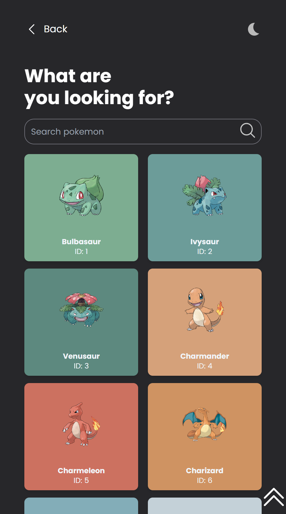

# Pokedex Application

Welcome to the Pokedex Application project! This application was developed during my time as a tutor at women who code. The purpose of this project is to showcase a simple Pokedex application built using vanilla JavaScript. The application allows users to search for and view information about different Pokemon species.



## Table of Contents

- [Pokedex Application](#pokedex-application)
  - [Table of Contents](#table-of-contents)
  - [Features](#features)
  - [Demo](#demo)
  - [Prerequisites](#prerequisites)
  - [Installation](#installation)
  - [Usage](#usage)

## Features

- Search for Pokemon species by name or ID.
- View detailed information about each Pokemon, including its type and stats.
- Responsive design for seamless use on various devices.

## Demo

A live demo of the application can be found [here](https://dylasx.github.io/pokedex-wwc/).

## Prerequisites

All you need to get started with this project is a modern web browser.

## Installation

1. Clone this repository:

   ```bash
   git clone https://github.com/yourusername/pokedex-app.git
   cd pokedex-app

## Usage

1. Open the index.html file in a web browser.
2. Use the search bar to find Pokemon species by entering their name or ID.
3. Click on a Pokemon card to view detailed information about the selected Pokemon.

Contributing
Contributions to this project are not currently being accepted, as it was created as a part of a bootcamp assignment. However, if you have suggestions or improvements, feel free to fork the repository and work on your own version!

License
This project is licensed under the MIT [License](license).
